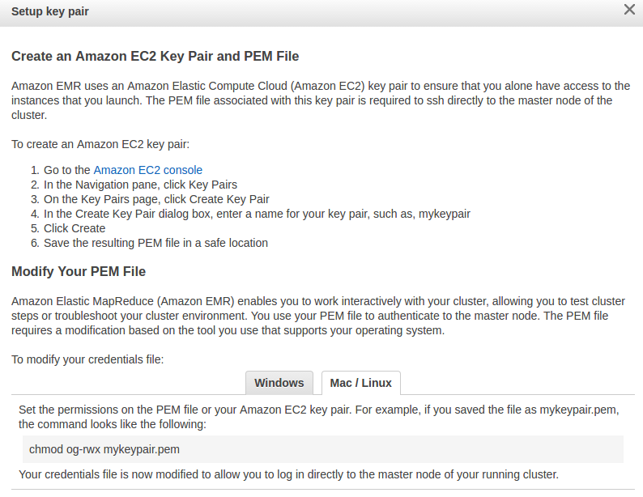

# nba-movement-hive
Tutorial on creating cloud infrastructure to store and use SportVU movement data. This tutorial was made for linux users.

### Package Setup

1. Modify the `movement/constant.py` file for the cloned repo location.

```py
import os
# change this data_dir for personal path
if os.environ['HOME'] == '/home/neil':
    data_dir = '/home/neil/projects/nba-movement-hive'
else:
    raise Exception("Unspecified data_dir, unknown environment")
```

2. Install the Python package

```
python setup.py build
sudo python setup.py install
```

### Data Setup

1. Extract the data from the `data` folder
```
cd data/
sudo ./setup.sh
```

2. Convert the json files to the proper csv files

```
python movement/json_to_csv.py
```

# Amazon Setup

### PEM Setup

AWS requires a secure key in order to SSH into the EMR instances. In order to do so, instructions are provided to create a pem key on the EC2 console below.



### S3 and EMR Setup

1. Create an S3 bucket on AWS and upload the csv documents extracted to the bucket. Make sure each item in the bucket is public.


2. Create a default EMR cluster on m1.medium instances (cheapest available) with one master and 2 core nodes. Wait until the cluster has a `waiting` status.

3. SSH into the EMR cluster. The EMR cluster should provide the proper command.
```
ssh - i {pem-key} {ec2-login}
```

4. If you get an error denying access because the key is public, you can edit the permissions with
```
chmod 400 {pem-key}
```

5. Create table in EMR once connected to the cluster. Enter the hive tool and paste the `tables/create_movement_hive.sql` script to create the table. Pase the `tables\load_data_hive.sql` script to load the csv's downloaded to the cluster.
```
hive
```
