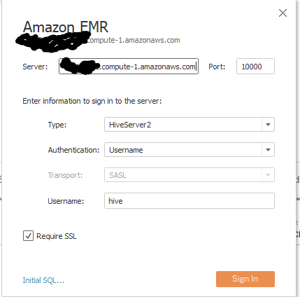

# nba-movement-hive
Tutorial on creating cloud infrastructure to store and use SportVU movement data. This tutorial was made for linux users. Because this tutorial utilizes tableau for visualizations, it requires windows for those steps.

### Package Setup

1. Modify the `movement/constant.py` file for the cloned repo location.

```py
import os
# change this data_dir for personal path
if os.environ['HOME'] == '/home/neil':
    data_dir = '/home/neil/projects/nba-movement-hive'
else:
    raise Exception("Unspecified data_dir, unknown environment")
```

2. Install the Python package

```
python setup.py build
sudo python setup.py install
```

### Data Setup

1. Extract the data from the `data` folder
```
cd data/
sudo ./setup.sh
```

2. Convert the json files to the proper csv files

```
python movement/json_to_csv.py
```

# Amazon Setup

### PEM Setup

AWS requires a secure key in order to SSH into the EMR instances. In order to do so, instructions are provided to create a pem key on the EC2 console below.


### S3 and EMR Setup

1. Create an S3 bucket on AWS and upload the csv documents extracted to the bucket. Make sure each item in the bucket is public.


2. Create a default EMR cluster on m1.medium instances (cheapest available) with one master and 2 core nodes. Wait until the cluster has a `waiting` status.

3. Add an inbound rule to the master security group on the cluster for all connections. See the **anywhere** rule at the bottom of the below image.


3. SSH into the EMR cluster. The EMR cluster should provide the proper command.
```
ssh - i {pem-key} {ec2-login}
```

4. If you get an error denying access because the key is public, you can edit the permissions with
```
chmod 400 {pem-key}
```

5. Create table in EMR once connected to the cluster. Enter the hive tool and paste the `tables/create_movement_hive.sql`, `tables/create_shots_hive.sql` scripts to create the table. Pase the `tables/load_data_hive.sql` script to load the csv's downloaded to the cluster.
```
hive
```

6. Verify the data stored by querying the different games stored.
```sql
select distinct(game_id) from movement;
```

### Tableau Setup

1. Install Tableau Desktop (not public version).

2. Install the [ODBC drivers](https://s3.amazonaws.com/amazon-odbc-jdbc-drivers/public/AmazonHiveODBC_1.1.1.1001.zip) for HiveServer2.

3. Add Amazon Hive ODBC drivers to the ODBC Data Source Admin tool in Windows.


4. Add the dns url from the cluster in the configuration for the driver on the ODBC Admin Tool.


5. Add the EMR connection on tableau. Use the same port and username as before. Enable ssl connection.



6. Once the connection is opened, you can add the schema and the tables you want to visualize.


### Tableau Sheet Setup

1. Once the data connection is setup, you can start playing with the shot data. Check off `Analysis > Aggregate Measures`.

2. Import the `img/nba_court.jpg` as a background image. Go to `Map > Background Images` and use the below setting for the half court display.


3. Use the `Loc X` for the columns and the `Loc Y` field for the rows.

4. Create art.

```
Note that these operations take a lot of time due to the external queries and how advanced the EC2 instances you chose to use on the EMR cluster are.
```
